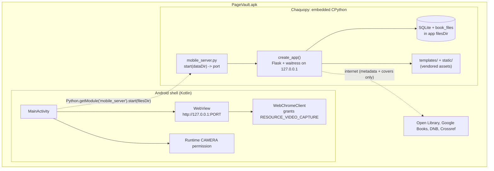

# PageVault for Android: Implementation Plan

Status: accepted; Phase 0/1 foundation built on branch `feature/android-app`
Target: a fully on-device Android app that reuses the existing Flask/SQLite codebase
Chosen approach: embed the current Flask app in an Android `WebView` via Chaquopy

## Implementation status

Done and verified off-device (no Android SDK on the build machine, so the APK
itself is not yet compiled):

- Front-end vendored for offline use; the app uses no CDN at runtime.
- `android/` Gradle project: Chaquopy config, `MainActivity` (WebView, camera
  permission bridge, file upload, downloads, back navigation, branded splash),
  `mobile_server.py` entry point, brand theme and adaptive icon.
- `mobile_server.start()` verified end-to-end here: boots waitress on a stable
  loopback port, serves the app, API and assets, creates the on-device database.
- Native-app polish and the `is_mobile_app` flag (hides admin and phone-connect);
  offline cover caching via the service worker.
- 129 tests pass; ruff and mypy clean.

Pending (needs the Android toolchain, i.e. you in Android Studio):

- First Gradle build and version alignment (AGP, Chaquopy, Kotlin, NDK).
- On-device Phase 0 checks: server boots in the WebView, camera scan works.
- Phases 2-3 on-device validation: reader, import/export, backup; then packaging.

See `android/README.md` for the build and verification steps.

---

## 1. Objective and scope

Deliver an Android app that runs PageVault entirely on the phone, with the camera used for
ISBN barcode scanning, reaching feature parity with the desktop and web builds. Admin login is
deliberately excluded.

### In scope
- Local SQLite database and book-file storage in the app's private directory.
- Camera ISBN scanning through the existing html5-qrcode scanner.
- Full catalogue workflow: book CRUD, shelves, tags, half-star reviews, quotes, reading history,
  sessions, and goals.
- Statistics dashboard, CSV import and export, backup and restore.
- E-book upload and the EPUB/PDF reader.
- Offline operation for every workflow that does not inherently need the internet.

### Out of scope
- Admin console and admin login (not needed on a single-user device).
- The LAN "connect a phone" flow and its QR code (the phone is the device).
- Self-signed TLS and the `cryptography` dependency (loopback needs no certificate).

### The one online dependency, stated honestly
Resolving a scanned ISBN into title, author, and cover reaches Open Library, Google Books, the
Deutsche Nationalbibliothek, and Crossref, exactly as the desktop build does today. Cover
thumbnails are fetched from the same sources. Offline, scanning still captures the barcode and a
book can be entered by hand; only the automatic metadata fill is unavailable. Covers will be
downloaded and cached to local storage on first fetch so they persist afterwards. There is no
attempt to bundle an offline book database.

---

## 2. Why this approach

The desktop build already proves the pattern the app needs. `desktop.py` starts a local WSGI
server and renders the existing web UI in a native webview. On Android the recipe is identical:
run the same Flask app on a loopback port inside the app process, and point an Android `WebView`
at `http://127.0.0.1:<port>`. Two properties make this clean:

1. `http://127.0.0.1` and `http://localhost` are secure contexts under the W3C secure-context
   rules, and Android's Chromium-based System WebView honours that. `getUserMedia` and the
   existing scanner run with no certificate.
2. Every runtime dependency (Flask, Werkzeug, waitress) is pure Python, so embedding CPython on
   Android carries no native-wheel risk. `cryptography` is imported lazily inside `tls.py` and is
   never reached when `PAGEVAULT_HTTPS=0`, so it is simply omitted from the Android build.

The backend (`app.py`, `pagevault_core/`), the templates, and the frontend JavaScript carry over
essentially unchanged.

---

## 3. Architecture



Boot sequence:
1. `MainActivity` requests the `CAMERA` runtime permission.
2. It calls into Chaquopy: `mobile_server.start(filesDir)`, which sets `PAGEVAULT_DATA_DIR` and
   `PAGEVAULT_HTTPS=0`, builds the Flask app, binds waitress to a free loopback port, and returns
   the port.
3. `MainActivity` loads `http://127.0.0.1:<port>/` in the `WebView`.
4. A `WebChromeClient.onPermissionRequest` grants `RESOURCE_VIDEO_CAPTURE` so the in-page scanner
   can open the camera.

---

## 4. Project layout

A new `android/` directory at the repo root, kept separate from the Python package:

```
android/
├── settings.gradle
├── build.gradle                       # AGP + Chaquopy plugin versions
├── gradle.properties
└── app/
    ├── build.gradle                   # Chaquopy config: Python version, pip deps, srcDirs
    └── src/main/
        ├── AndroidManifest.xml        # CAMERA + INTERNET, single Activity
        ├── java/com/pagevault/app/
        │   └── MainActivity.kt        # WebView + camera bridge + permission flow
        ├── python/
        │   └── mobile_server.py       # Android entry point (start server, return port)
        └── res/                       # launcher icon, strings, theme
```

Chaquopy's `sourceSets.main.python.srcDirs` will include the repo root so `app.py`, `config.py`,
and `pagevault_core/` are on the Python path, together with `templates/` and `static/` so
`resource_dir()` (which resolves relative to the module file) finds them unchanged.

---

## 5. Component detail

### 5.1 Python entry point (`mobile_server.py`, new)
Small module, the Android analogue of `desktop.py`:
- Set `PAGEVAULT_DATA_DIR` to the Android `filesDir` passed from Kotlin.
- Set `PAGEVAULT_HTTPS=0` so the TLS path is never taken.
- Persist a stable `SECRET_KEY` in the data directory (reuse the helper logic from `desktop.py`).
- Bind waitress to `127.0.0.1` on an OS-assigned free port and return the port to Kotlin.
- Run the server on a daemon thread so it does not block the Android main thread.

### 5.2 Android shell (`MainActivity.kt`, new)
- Start Python through Chaquopy and obtain the port.
- Configure the `WebView`: JavaScript enabled, DOM storage enabled, media playback allowed
  without a user gesture, file access for the reader as needed.
- Install a `WebChromeClient` whose `onPermissionRequest` grants `RESOURCE_VIDEO_CAPTURE`.
- Request the Android `CAMERA` runtime permission before loading the scanner.
- Handle the hardware back button as in-app navigation (`WebView.goBack()`).

### 5.3 Storage
`config.py` already resolves the database, book files, and log location from `PAGEVAULT_DATA_DIR`.
Pointing that at `filesDir` is the only change, so all writable state lands in the app's private,
per-install directory. No schema or path-handling changes.

### 5.4 Asset vendoring (required for offline)
These load from CDNs today and must be bundled into `static/` (and the templates repointed):

| Library | Used by | Action |
|---|---|---|
| html5-qrcode 2.3.8 | scanner (`index.html`) | vendor to `static/vendor/` |
| Plotly 2.35.2 | stats (`stats.html`) | vendor to `static/vendor/` |
| epub.js 0.3.93 | reader (`reader.html`, `index.html`) | vendor to `static/vendor/` |
| qrcodejs 1.0.0 | phone-connect QR (`index.html`) | drop (feature removed on device) |
| Google Fonts (Playfair Display, Lato) | all pages | vendor as local `@font-face`, or fall back to system serif/sans |

Vendoring also benefits the desktop and web builds, so it can be done on the shared frontend
rather than forked for Android. The Subresource Integrity attributes are removed for local files.

### 5.5 Offline behaviour
- Metadata lookup already degrades: a failed fetch returns `None` and the UI allows manual entry.
  Add a clear offline indication in the add-book flow.
- Cover caching: on first successful fetch, download the image to `book_files` (or a `covers/`
  subdirectory) and rewrite the stored cover reference to the local path, so covers survive
  offline and across app restarts. This is a small backend addition.

### 5.6 Changes to existing code (kept minimal)
- New `mobile_server.py` (Android entry point).
- Frontend: repoint five CDN references to local assets; hide the admin and phone-connect buttons
  behind the existing template flag mechanism (as `mobile_qr` already does).
- Optional cover-cache helper in `pagevault_core/metadata.py` or the API layer.
- No changes to `api.py`, `db.py`, `config.py`, or the SQLite schema.

---

## 6. Phased delivery

Each phase ends with a concrete, testable deliverable.

### Phase 0: De-risking spike (do first)
Prove the two riskiest pieces before any real integration.
- Bare Android project with Chaquopy running a trivial Flask "hello" on loopback in a `WebView`.
- `CAMERA` permission granted and one successful barcode scan on a physical device.
- Acceptance: a real phone shows the page served from on-device Python and completes one scan.

### Phase 1: Core parity
- Wire the real Flask app, `filesDir` storage, and vendored assets.
- Cover caching and offline-graceful metadata.
- Acceptance: scan, add, edit, shelves, tags, reviews, quotes, reading history and goals, and the
  stats dashboard all work on-device, offline except for metadata and first-time cover fetches.

### Phase 2: Heavy features
- EPUB/PDF upload and the epub.js reader (position sync already exists server-side).
- CSV import and export, backup and restore against the on-device store.
- Acceptance: import a Goodreads CSV, open an EPUB, export a backup, restore it.

### Phase 3: Packaging
- Launcher icon, app theme, signing config, a debug APK to sideload.
- Optional later: a release build and Play Store submission (adds privacy-policy and review work).
- Acceptance: an installable signed APK produced from a clean build.

---

## 7. Toolchain and build (Windows)

- Android Studio (bundles the Android SDK and an emulator) plus a JDK 17.
- Chaquopy Gradle plugin, configured for a recent CPython (for example 3.11 or 3.12) in
  `app/build.gradle`; pip dependencies limited to `flask`, `werkzeug`, `waitress`.
- Build locally with `gradlew assembleDebug`; test on a physical device over USB debugging for the
  real camera.
- CI later: a GitHub Actions workflow mirroring `desktop-release.yml`, producing an APK artefact.

---

## 8. Testing

- The existing 129 pytest tests keep covering the Python core unchanged; the mobile entry point
  gets a light unit test (server starts, returns a port, serves `/`).
- Manual device matrix for the WebView-specific paths: camera scan, reader rendering, file upload
  picker, and back-button navigation.
- Early, repeated testing on a physical device for the camera bridge, since that is the main
  unknown.

---

## 9. Risks and mitigations

| Risk | Likelihood | Mitigation |
|---|---|---|
| WebView camera bridge misbehaves on some Android versions | Medium | Phase 0 spike on a real device before any integration |
| Chaquopy licensing or version constraints | Low | Free for current versions; confirm terms and pin a supported AGP/Chaquopy pair up front |
| APK size from bundling CPython and stdlib | Medium | Accept it; trim unused stdlib and use ABI splits if needed |
| epub.js or Plotly behave differently in WebView | Low | Vendored and tested in Phase 1/2; both are widely used in WebViews |
| Cold-start latency while Python boots the server | Low | Show a splash until the port is reachable; waitress starts in well under a second |

---

## 10. Repository and branch strategy

- Work on a `feature/android-app` branch off `develop`, consistent with the existing
  `feature/desktop-executable` history.
- Keep `android/` isolated so the Python package, its CI, and its release workflow are unaffected.
- Shared frontend changes (asset vendoring) merge once and benefit all three builds.

---

## 11. Open decisions for later phases

- Distribution: personal sideload APK first (assumed), with Play Store as an optional later step.
- Barcode engine: reuse html5-qrcode initially (zero rewrite); a native ML Kit scanner via a small
  JavaScript bridge is a possible future upgrade for speed and accuracy.
- Minimum Android version: propose API 26 (Android 8.0) or higher, revisited against Chaquopy and
  WebView requirements in Phase 0.
```
