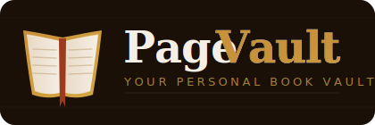

<p align="center">
  
</p>

<p align="center">
  <strong>A self-hosted, local Goodreads alternative.</strong><br/>
  Scan ISBN barcodes with your phone · Fetch covers & metadata automatically · Keep your reading life private.
</p>

<br/>

<p align="center">
  <a href="https://github.com/ChristianAbele02/PageVault/actions/workflows/ci.yml">
    
  </a>
  &nbsp;
  <a href="https://github.com/ChristianAbele02/PageVault/releases">
    
  </a>
  &nbsp;
  
  &nbsp;
  
  &nbsp;
  
  &nbsp;
  <a href="LICENSE">
    
  </a>
</p>

---

## What is PageVault?

PageVault is a lightweight, **100% local** book catalog that runs on your own machine. Point your phone camera at any ISBN barcode — the app fetches the title, author, cover, and metadata instantly, and stores everything in a single SQLite file that never leaves your device.

Think Goodreads, but yours.

---

## Features

**📷 Scan any book in seconds**
Open PageVault on your phone browser, tap the scan button, and point at the barcode. No app install. No account.

**📚 Automatic metadata**
Title, author, cover image, publisher, year, and page count — fetched with provider fallback: [Open Library](https://openlibrary.org) → Google Books → Crossref.

**⭐ Ratings & personal notes**
Give each book a 1–5 star rating and add written notes. Build up a reading journal over time.

**🔖 Reading status**
Track every book as *Want to Read*, *Currently Reading*, or *Read*.

**🗂️ Custom shelves / lists**
Create as many named shelves as you want, attach an optional logo URL, and place books in multiple shelves.

**🏷️ Genre tags**
Attach multiple genre tags to each book for cleaner categorization and better discovery.
Tags are managed as interactive chips (add/remove individually), with duplicate protection and a max of 10 tags.

**🌗 Day/Night library themes**
Dark mode (default) uses a candlelit library look; light mode switches to a daylight library style.
Theme preference is remembered locally.

**🔍 Search & filter**
Filter by status, author, genre tag, shelf, and text search.

**🔄 Metadata refresh**
Reload metadata for all saved books without touching your reviews, star ratings, shelves, or manual tags.

**📤📥 CSV export/import**
Export your full library to CSV and import CSV files back into PageVault. Goodreads CSV export files are supported.

**💾 Fully private, fully local**
Your entire library lives in one file: `pagevault.db`. Back it up by copying it. Restore by pasting it back.

**🐳 Docker ready**
One command to run, persistent volume for your data.

---

## Quick Start

### Python (recommended)

> Requires Python 3.10 or newer.

```bash
git clone https://github.com/ChristianAbele02/PageVault.git
cd pagevault
pip install -r requirements.txt
python app.py
```

Open **http://localhost:5000** in your browser.

### Docker

```bash
git clone https://github.com/ChristianAbele02/PageVault.git
cd pagevault
docker compose up -d
```

PageVault starts at **http://localhost:5000**. Data persists in a named Docker volume.

---

## Accessing from your phone

Find your computer's local IP, then open `http://YOUR-IP:5000` on your phone (same Wi-Fi network).

```bash
# macOS
ipconfig getifaddr en0

# Windows (in PowerShell)
ipconfig

# Linux
hostname -I
```

> **Safari on iOS?** Apple requires HTTPS for camera access on non-localhost addresses. See the [HTTPS setup guide](#https-setup-for-ios-safari) below.

---

## Usage

### Adding a book

| Step | Action |
|------|--------|
| 1 | Tap **+** (bottom right) |
| 2 | Tap **Scan ISBN Barcode** and allow camera access |
| 3 | Point at the barcode on the back cover |
| 4 | Confirm the fetched details and tap **Add to My Shelf** |

Can't scan? Type the ISBN manually and tap **Look up**. If the book isn't in Open Library, fill in the title and author yourself.

### Rating a book

Tap any book → pick a star rating → write an optional note → **Save Review**. Add as many notes as you like over time.

Review timestamps are displayed in `DD.MM.YYYY HH:MM` format.

### Theme switching

- Use the **Light/Dark** toggle in the header.
- Dark mode is the default appearance.
- The selected theme is persisted in your browser.

### Genre tag chips

- Add tags with **Enter**, **comma (,)**, or **Tab**.
- Remove tags with the **✕** on each chip.
- Duplicate tags are prevented and show an inline message.
- Max 10 tags per book, with a live counter (`x/10`).

### Exporting your library

```bash
curl http://localhost:5000/api/export > my_library.json
```

### Exporting / importing CSV

- Use the floating **⇩** button next to **+** to export CSV.
- Use the floating **⇧** button next to **+** to import a CSV file.
- Goodreads CSV exports are supported (`My Books` export format).

### Reloading metadata for all books

- Use the **Reload metadata** button in the top controls.
- This updates only core metadata fields (title, author, cover, description, publisher, year, pages, language, genre).
- Reviews/stars, shelves, and manual tags stay untouched.

---

## HTTPS Setup for iOS Safari

Safari requires HTTPS for camera access when the host isn't `localhost`. The quickest fix:

```bash
# Install mkcert (creates locally-trusted certificates)
brew install mkcert          # macOS
# or: https://github.com/FiloSottile/mkcert#installation

mkcert -install
mkcert localhost 127.0.0.1 192.168.x.x   # replace with your local IP
```

Then edit the last line of `app.py`:

```python
app.run(host="0.0.0.0", port=5000, ssl_context=("localhost+2.pem", "localhost+2-key.pem"))
```

Open `https://192.168.x.x:5000` on your iPhone.

---

## REST API

All responses are JSON. The base URL is `http://localhost:5000`.

| Method | Endpoint | Description |
|--------|----------|-------------|
| `GET` | `/api/books` | List books — supports `?status=`, `?author=`, `?genre=`, `?shelf_id=`, `?q=`, `?sort=`, `?order=` |
| `POST` | `/api/books` | Add a book `{ isbn, status?, genre_tags?, shelf_ids?, book_data? }` |
| `GET` | `/api/books/:id` | Book detail including all reviews |
| `PATCH` | `/api/books/:id` | Update `status`, `title`, `author`, `description`, `genre_tags`, `shelf_ids` |
| `DELETE` | `/api/books/:id` | Delete a book (reviews cascade) |
| `GET` | `/api/shelves` | List custom shelves with book counts |
| `POST` | `/api/shelves` | Create shelf `{ name, logo_url? }` |
| `PATCH` | `/api/shelves/:id` | Rename shelf and/or update logo URL |
| `DELETE` | `/api/shelves/:id` | Delete shelf (book relations cascade) |
| `GET` | `/api/lookup/:isbn` | Preview ISBN metadata without saving |
| `POST` | `/api/books/refresh` | Refresh metadata for all books (preserves reviews/tags/shelves) |
| `POST` | `/api/books/:id/reviews` | Add review `{ rating?, comment? }` |
| `DELETE` | `/api/books/:id/reviews/:rid` | Remove a review |
| `GET` | `/api/stats` | Library statistics |
| `GET` | `/api/export` | Full library export as JSON |
| `GET` | `/api/export/csv` | Export full library as CSV |
| `POST` | `/api/import/csv` | Import PageVault or Goodreads-compatible CSV |

**Example — add a book and review it:**

```bash
# Add by ISBN (metadata fetched automatically)
curl -X POST http://localhost:5000/api/books \
  -H "Content-Type: application/json" \
  -d '{"isbn": "9780451524935", "status": "read"}'

# Add a review
curl -X POST http://localhost:5000/api/books/1/reviews \
  -H "Content-Type: application/json" \
  -d '{"rating": 5, "comment": "Essential reading."}'
```

---

## Backup & Restore

Everything is in one file.

```bash
# Backup
cp pagevault.db pagevault_backup.db

# Restore
cp pagevault_backup.db pagevault.db
```

With Docker:

```bash
# Backup
docker cp pagevault:/data/pagevault.db ./pagevault_backup.db

# Restore
docker cp ./pagevault_backup.db pagevault:/data/pagevault.db
```

---

## Development

```bash
# Install dev dependencies (pytest, ruff, mypy)
make dev

# Run tests
make test

# Run tests with coverage
make coverage

# Lint
make lint

# Auto-format
make format
```

## Core Infrastructure

PageVault is now organized into a lightweight core package so features can grow without a single massive script.

- **`app.py`**: app factory + dependency wiring + entrypoint.
- **`pagevault_core/api.py`**: REST blueprint (`/api`) with all route handlers.
- **`pagevault_core/db.py`**: SQLite lifecycle (`get_db`, hooks, schema bootstrap).
- **`pagevault_core/metadata.py`**: ISBN metadata providers + merge chain.
- **`pagevault_core/utils.py`**: shared validation and parsing helpers.

### Metadata fallback chain

When you look up an ISBN (or run metadata refresh), PageVault resolves metadata in this order:

1. Open Library
2. Google Books
3. Crossref

Fields are merged progressively so missing values are filled without discarding good data from earlier providers.

### CSV architecture

- **Export (`/api/export/csv`)** writes library rows including book metadata, shelves, tags, and review summary fields.
- **Import (`/api/import/csv`)** accepts both PageVault CSV and Goodreads-compatible CSV headers.
- Import merges metadata safely and preserves existing data where appropriate.

### Project layout

```
pagevault/
├── app.py                        App factory + dependency wiring + entrypoint
├── pagevault_core/
│   ├── __init__.py
│   ├── api.py                    API blueprint and route handlers
│   ├── db.py                     SQLite connection + schema bootstrap
│   ├── metadata.py               OpenLibrary/Google/Crossref lookup + merge
│   └── utils.py                  Shared parsing/validation helpers
├── templates/
│   └── index.html                Complete frontend (HTML + CSS + JS, single file)
├── tests/
│   ├── conftest.py               Shared pytest fixtures
│   └── test_api.py               API + CSV + fallback coverage (currently monolithic)
├── assets/
│   ├── logo.svg                  Full wordmark logo
│   └── icon.svg                  Square icon (GitHub avatar, favicon)
├── .github/
│   ├── workflows/ci.yml          GitHub Actions: test · lint · Docker build
│   ├── ISSUE_TEMPLATE/           Bug report & feature request forms
│   ├── PULL_REQUEST_TEMPLATE.md
│   └── dependabot.yml
├── .devcontainer/
│   └── devcontainer.json         One-click GitHub Codespaces setup
├── Dockerfile                    Multi-stage, non-root, gunicorn
├── docker-compose.yml
├── Makefile
├── pyproject.toml
├── requirements.txt
├── requirements-dev.txt
├── CHANGELOG.md
├── CONTRIBUTING.md
└── SECURITY.md
```

---

## Roadmap

- [ ] Goodreads import mapping presets (regional variants)
- [ ] Reading progress (current page)
- [ ] Annual reading goal tracker
- [ ] Optional password protection

Have an idea? [Open a feature request](https://github.com/ChristianAbele02/PageVault/issues/new/choose).

---

## Contributing

Contributions are welcome. Please read [CONTRIBUTING.md](CONTRIBUTING.md) before opening a PR.

Found a security issue? See [SECURITY.md](SECURITY.md) for how to report it privately.

---

## License

MIT — see [LICENSE](LICENSE).

---

<p align="center">
  Built with <a href="https://flask.palletsprojects.com">Flask</a> ·
  <a href="https://www.sqlite.org">SQLite</a> ·
  <a href="https://openlibrary.org">Open Library API</a>
  <br/><br/>
  
</p>
